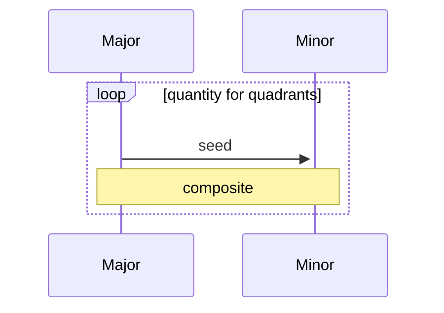

# seedmap
Generate canvas tiles using 2d noise from seed. Major/minor pass preserves primary detail quadrants cross-resolution.

### usage
* `seed` -- Starting value for recursive noise. Default is Math.random().
* `size` -- Dimension of canvases. Default is 64.
* `quantity` -- Number of canvases. Default is 1.

```javascript
import { seedmap } from "./seedmap.js";

// parameters
let seed = Math.random()
let size = 64;
let quantity = 2;
// run...
let res = seedmap(seed, size, quantity);
```
### response

```javascript
console.log(res)
{
  dat: {pos: 4800, neg: 6400, time: 24.0}
  map: [canvas, canvas],
  max: 64,
  min: 4,
  seed: 12345678,
}
```



